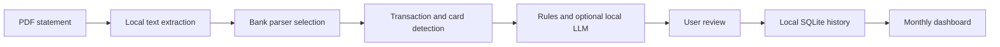

# Credit Card Statement Analyzer

A privacy-focused Streamlit application that parses credit card statement PDFs, categorizes transactions with deterministic rules and an optional local LLM, and stores reviewed history in a local SQLite database.

Designed by **Eric Liu**. Developed with AI coding assistance and reviewed through automated tests and iterative statement validation.

## Highlights

- Upload and combine multiple PDF statements.
- Select bank-specific parsers for Chase and Bank of America, with a generic fallback.
- Detect the card product and optional last four digits from statement text.
- Categorize merchants using explainable rules before consulting a local LLM.
- Review category, amount, merchant, and rule source before saving.
- Detect duplicate statements with a SHA-256 fingerprint of the PDF contents.
- Store reviewed statements and transactions in a local SQLite database.
- Explore persistent history by month, category, and credit card.
- Protect local history with a first-run account and password login.
- Run on Windows and macOS without sending statement contents to a cloud classification service.

## How Classification Works

The classifier uses an explicit priority order:

```text
User-defined merchant rules
        ↓
Built-in deterministic rules
        ↓
Optional local Ollama model
        ↓
Manual review / Uncategorized
```

Rules are normalized and matched locally. The optional Ollama classifier uses `llama3.2:3b`, a fixed category list, structured JSON output, temperature `0`, and a confidence threshold. Low-confidence or ambiguous merchants remain available for manual review instead of being forced into a category.

The transaction table records the classification source, keyword or model, prompt version, confidence, and explanation where applicable.

## Data Flow



Original PDFs are processed locally and are not stored in the database. The database does not store complete card numbers, CVV values, online banking credentials, or plain-text passwords.

## Quick Start

### Windows

1. Create a Python 3.12 virtual environment.
2. Install the dependencies:

   ```powershell
   python -m venv .venv
   .\.venv\Scripts\python.exe -m pip install -r requirements.txt
   ```

3. Double-click `启动信用卡账单分析器.bat`, or run:

   ```powershell
   .\.venv\Scripts\python.exe -m streamlit run app.py --server.address 127.0.0.1
   ```

### macOS

Run the included installer from the project directory:

```bash
chmod +x "macos/Install Credit Card Analyzer.command"
./macos/Install\ Credit\ Card\ Analyzer.command
```

The installer creates a private Python environment inside the application folder. The generated distribution ZIP is built with:

```powershell
.\.venv\Scripts\python.exe scripts\build_macos_bundle.py
```

## Optional Local AI

The app remains usable without Ollama. To enable local LLM categorization:

### Windows

```powershell
powershell -ExecutionPolicy Bypass -File .\scripts\setup_local_llm_windows.ps1
```

### macOS

```bash
chmod +x scripts/setup_local_llm_macos.sh
./scripts/setup_local_llm_macos.sh
```

Ollama serves the model only on the local machine at `http://localhost:11434`.

## Local Storage

The SQLite database is stored outside the repository:

- Windows: `%LOCALAPPDATA%\CreditCardStatementAnalyzer\analyzer.db`
- macOS: `~/Library/Application Support/CreditCardStatementAnalyzer/analyzer.db`
- Linux: `$XDG_DATA_HOME/CreditCardStatementAnalyzer/analyzer.db`

Personal merchant rules and LLM cache files are ignored by Git. A safe empty template is provided at `data/custom_merchant_rules.example.json`.

## Project Structure

```text
app.py                  Streamlit application and dashboard
categorization/         Rule-based merchant classification
data/                   Built-in rules and safe templates
models/                 Shared transaction model
parsers/                Bank selection and statement parsers
services/               PDF, database, transaction, and local LLM services
tests/                  Parser, classifier, database, and login tests
docs/                   Architecture and design documentation
macos/                  macOS installation and launch files
scripts/                Setup and packaging utilities
```

## Tests

Run the full test suite:

```powershell
.\.venv\Scripts\python.exe -m pytest -q
```

The tests cover parser selection, Bank of America parsing, card metadata, deterministic classification, custom-rule priority, local LLM output and caching, SQLite persistence, duplicate detection, schema migration, password hashing, account creation, login, and logout.

## Documentation

- [Categorization mechanism](docs/CATEGORIZATION.md)
- [Rule decision record](docs/RULE_DECISIONS.md)
- [Local LLM design](docs/LOCAL_LLM_CATEGORIZATION.md)
- [Database architecture](docs/DATABASE.md)
- [Windows and macOS packaging](docs/CROSS_PLATFORM_PACKAGING.md)
- [Weekly progress report](docs/WEEKLY_PROGRESS_REPORT_2026-07-24.md)

## Current Scope

This repository is currently a local, single-user application. Its login is a local access gate, not production multi-user authentication. A hosted release would require per-user ownership, PostgreSQL, managed authentication, HTTPS, rate limiting, password recovery, encrypted backups, and formal database migrations.

## Privacy Notes

- Do not commit real statement PDFs, CSV exports, SQLite files, LLM caches, or personal merchant rules.
- Use only synthetic or fully redacted text in tests and issues.
- Keep the Streamlit server bound to `127.0.0.1` for local use.
- Review staged files with `git status` and `git diff --cached` before every push.
